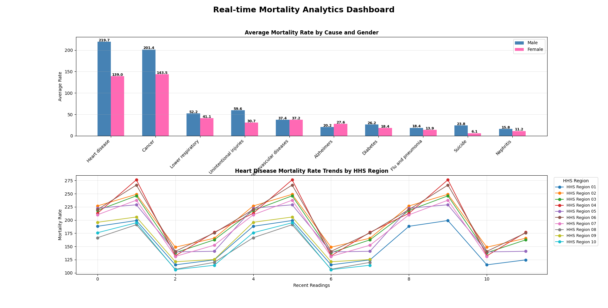

# buzzline-06-case (Mortality Data Streaming Pipeline)
### Name: Anjana Dhakal 09/29/2025

## Overview
This custom streaming pipeline processes real-time mortality data to analyze and visualize mortality rates across U.S. regions, with a special focus on Heart Disease. It simulates live data ingestion, processes health metrics, detects high-mortality events, and displays a continuously updating Matplotlib dashboard. The project combines data streaming, SQLite storage, and interactive analytics for public-health monitoring.


## Key Features

- Real-time Data Streaming: Reads mortality data from a CSV file and streams it in JSONL format.
- Region-specific Insights: Filters and analyzes data for all HHS regions.
- Trend Tracking: Highest mortality cause found in chart monitors mortality rates over time.
- Dynamic Visualization: Displays live charts with Matplotlib animation.
- Historical Data Storage: Saves processed messages in SQLite for later analysis.

## How It Works
### Producer (producer_mortality_anjana.py)
Streams mortality data by:

- Reading CSV files containing mortality statistics.
- Creating JSONL messages with region, status, sex, cause, rate, and SE.
- Saving messages to a live file and an SQLite database.

Each JSON message follows this structure:

```
{
    "message": "In HHS Region 01, Urban Male population reported Heart disease mortality at 188.2 (SE 1.0).",
    "author": "HHS_Region_01",
    "timestamp": "2025-09-27 23:44:00",
    "category": "heart_disease",
    "region": "HHS Region 01",
    "status": "Urban",
    "sex": "Male",
    "cause": "Heart disease",
    "rate": 188.2,
    "se": 1.0
}
```

### Consumer (consumer_mortality_anjana.py)
The consumer performs real-time analytics and visualization:

- Custom consumer reads JSONL messages from data/project_live.json.
- Extracts key fields, and tracks the average mortality rate by cause and gender using dictionaries and deques.
- For the high-cause Heart Disease, it aggregates statistics by gender and region.
- Detect high mortality events (rate ≥ 100) and count them.
- Store processed data in SQLite (data/mortality_analytics.sqlite).
- Update a real-time visualization dashboard.

### Dynamic Visualization

The consumer displays a live dashboard with two charts:

1. Average Mortality Rate by Cause and Gender

- Bar chart showing average mortality rates for each cause.
- Splits each cause’s rate by gender (Male vs. Female).
- Helps identify gender differences across causes at a glance.
  { X-axis: Cause of Death (e.g., Heart Disease, Cancer, Stroke, etc.}
  { Y-axis: Average Mortality Rate (per 100,000 population)}

2. Heart Disease Rate Trends by Region

- Line chart showing mortality rate trends for heart disease across HHS regions.
- Different colors for each region.
   {X-axis: Time (Recent Streamed Intervals)}
    {(Y-axis: Mortality Rate (per 100,000 population)}
         

## Running the Pipeline
 1. Manage Local Project Virtual Environment

Open your project in VS Code and use the commands for your operating system to:

1. Create a Python virtual environment.
2. Activate the virtual environment.
3. Upgrade pip and key tools. 
4. Install from requirements.txt.
5. Intsall matplotlib

Open a new PowerShell terminal in VS Code (Terminal / New Terminal / PowerShell).
**Python 3.11** is required for Apache Kafka. 

```powershell
py -3.11 -m venv .venv
.\.venv\Scripts\Activate.ps1
py -m pip install --upgrade pip wheel setuptools
py -m pip install --upgrade -r requirements.txt
pip install matplotlib
```


2. Run Tests and Verify Emitters

In the same terminal used for Task 2, we'll run some tests to ensure that all four emitters are working fine on your machine.  All tests should pass if everything is installed and set up correctly. 

```shell
pytest -v
```

Then run the `verify_emitters.py` script as a module to check that we can emit to all four types. 
For the Kakfa sink to work, the Kafka service must be running. 


```shell
py -m verify_emitters
```


3. Start a New Streaming Application

This will take two terminals:

1. Producer Terminal 
 
In VS Code, open a NEW terminal.
Use the commands below to activate .venv, and start the producer. 

Windows:

```shell
.\.venv\Scripts\Activate.ps1
py -m producers.producer_mortality_anjana
```


2. Consumer Terminal (Various Options)

In VS Code, open a NEW terminal in your root project folder. 
Use the commands below to activate .venv, and start the consumer. 

Windows:
```shell
.\.venv\Scripts\Activate.ps1
py -m consumers.consumer_mortality_anjana
```

The consumer opens a Matplotlib window displaying live dashboards that update continuously as new messages arrive.

### Data Storage

Database: SQLite (data/mortality_analytics.sqlite)

### Live chart Image 

[](https://github.com/anjana-codes/buzzline-06-anjana/blob/main/image/live_dashboard.jpg)
